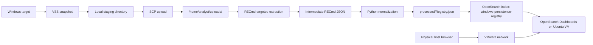

# Architecture

## Goal

The project collects raw Windows persistence artifacts from live Windows 10 and Windows 11 targets, processes registry hives on Ubuntu 22.04, and indexes normalized registry records into OpenSearch. The analyst works in OpenSearch Dashboards with the original normalized registry records, using filters, tables, and aggregations to identify suspicious persistence.

## Data Flow



## Acquisition Layer

`scripts/windows/Acquire-PersistenceArtifacts.ps1` runs from an elevated PowerShell session. It creates a Volume Shadow Copy Service snapshot of the system drive and copies locked registry hive files from the snapshot path. This preserves the forensic model: the Windows host sends raw files, while parsing and analysis happen on Ubuntu.

The upload directory has this structure:

```text
<host_timestamp>/
  Reg/
    SOFTWARE
    SOFTWARE.LOG1
    SOFTWARE.LOG2
    SYSTEM
    SYSTEM.LOG1
    SYSTEM.LOG2
    SAM
    SECURITY
  NTUSER/
    <username>.DAT
    <username>.LOG1
    <username>.LOG2
  UsrClass/
    <username>.DAT
    <username>.LOG1
    <username>.LOG2
  ScheduledTasks/
  Services/
  EventLogs/
  WMI/
  manifest.json
```

Optional files may be absent on real hosts. The collector records copied files, sizes, and SHA-256 hashes in `manifest.json`.

## Processing Layer

The Python package in `src/persist_detector` has four responsibilities:

1. Discover supported hives in the uploaded directory.
2. Run RECmd against selected parent registry branches.
3. Normalize RECmd JSON into `Registry.json`.
4. Index `Registry.json` into OpenSearch.

The primary command is:

```bash
PYTHONPATH=src python3 -m persist_detector process \
  --input /home/analyst/uploads/<host_timestamp> \
  --recmd /usr/local/bin/recmd \
  --opensearch-url https://localhost:9200 \
  --opensearch-username admin \
  --opensearch-password '<admin-password>' \
  --opensearch-insecure
```

Intermediate RECmd JSON is written under `processed/extracted`. It is removed after successful normalization unless `--keep-extracted` is used.

## Normalized Record Model

`Registry.json` is newline-delimited JSON. Each line is one registry value record:

```json
{"@timestamp":"2026-05-19T09:34:56","file.name":"Updater","file.path":"C:\\Users\\Public\\updater.exe","host.name":"WIN10-LAB","reg.key.name":"Run","reg.key.path":"Software\\Microsoft\\Windows\\CurrentVersion\\Run"}
```

Normalization behavior:

- Recursively flattens RECmd `SubKeys`.
- Emits one record per registry value.
- Keeps only values with a registry value type.
- Drops empty and numeric-only value data.
- Rewrites `ROOT` to `Software`, `System`, `NTUSER.DAT-<username>`, or `UsrClass-<username>`.
- Converts key last-write timestamps to UTC-3 with `YYYY-MM-DDTHH:MM:SS`.
- Emits only the thesis-required registry fields.

## OpenSearch Index

Records are indexed into:

```text
windows-persistence-registry
```

The mapping is stored in:

```text
opensearch/index/windows-persistence-registry.json
```

The main fields used by analysts are mapped as `keyword` so they can be filtered, grouped, and sorted:

- `host.name`
- `reg.key.path`
- `reg.key.name`
- `file.name`
- `file.path`

`@timestamp` is mapped as `date` for time filtering in OpenSearch Dashboards.

## Dashboard Access Path

OpenSearch Dashboards runs on the Ubuntu analysis VM and must listen on the VM network interface, not only on loopback. The required access path is:

```text
Physical host browser -> VMware network -> Ubuntu VM port 5601 -> OpenSearch Dashboards
```

The deployment configures:

- OpenSearch API for local ingestion on `https://localhost:9200`.
- OpenSearch Dashboards bind address `server.host: "0.0.0.0"`.
- OpenSearch Dashboards port `server.port: 5601`.

This allows analysts to use `http://<UBUNTU_IP>:5601` from the physical host computer while keeping the Python processor and OpenSearch API traffic inside the Ubuntu VM unless the lab operator explicitly exposes additional services.

## Frequency Analysis Model

The project does not generate a frequency-analysis file. Frequency analysis is performed in OpenSearch Dashboards.

Common groupings:

- Terms on `file.path`: find rare commands, executables, DLLs, scripts, and screensaver binaries.
- Terms on `reg.key.path`: find uncommon persistence locations.
- Table with `reg.key.path`, `file.name`, and `file.path`: inspect exact persistence entries.

The useful sorting pattern is count ascending. Rare values appear first and become the analyst's initial triage queue.

## Alerting Templates

Reusable OpenSearch Alerting monitor templates are stored in:

```text
opensearch/monitors/
```

The templates cover:

- suspicious executable paths;
- rare executable paths;
- suspicious registry persistence locations;
- uncommon persistence entries.

Each template queries `windows-persistence-registry` and contains a trigger condition. Notification actions are intentionally empty so the operator can attach email, webhook, or other destinations during deployment.

## Limitations

- The project uses RECmd for raw registry hive parsing. It does not implement a registry hive parser.
- OpenSearch Dashboards analysis depends on the quality and size of the indexed dataset. A single host can identify obvious anomalies, while several hosts provide better frequency baselines.
- Monitor templates are starting points. They should be adjusted for the student's lab data, time ranges, and known-good software.
- The Windows acquisition script requires administrator privileges because VSS snapshot creation requires elevation.
